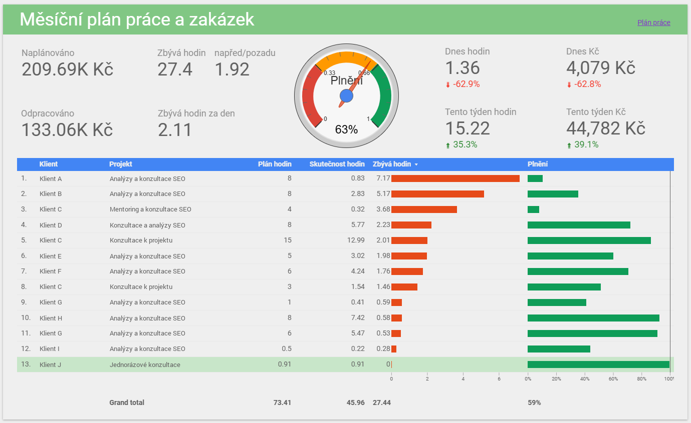

<!-- _class: lead -->
<!-- _paginate: skip -->

# Claude Code a Obsidian jako osobní asistent SEO konzultanta

<p class="podtitul">Marek Prokop · SEO Bootcamp 2026 · 18. 9. 2026</p>

---

<!-- _class: lead -->

<p class="velke">Agent je jen tak dobrý,<br>jak dobrá má data a nástroje.</p>

---

# Celé vybavení: hardware

- **Hlavní PC**: Windows. Tady pracuju já i Claude.
- **Mini server**: Asus NUC, Ubuntu. Tady pracuje jen Claude.
- **Monitor s KVM**: monitor, klávesnice a myš pro PC i NUC.
- **Telefon**: čtení poznámek, zápisy a zadávání práce na cestách.
- **Notebook** jen na výjimečné cesty a konference.

---

# Celé vybavení: software

- **Obsidian** všude přes Obsidian Sync.
- **Claude** aplikace i CLI na PC, NUC a notebooku, aplikace na telefonu.
- **CLI**: GWS CLI, DuckDB, Obsidian, `ssh` na NUC, Screaming Frog, Codex a Gemini.
- **MCP**: Fakturoid, Marketing Miner, Ahrefs.
- **Repa klientů v R**: crawly a analýzy.
- **Telefon**: Telegram, aplikace Claude s Remote Control.

---

# Obsidian: doplňky

<div class="cols mensi">
<div>

### Vestavěné

- Zpětné odkazy a vlastnosti.
- Sync.
- Daily notes: složka `daily/`.
- Calendar.
- Bases: tabulky z vlastností (Writing, Backlog, přednášky).

</div>
<div>

### Komunitní

- Tasks: úkoly.
- Folder Notes: poznámka se jménem složky uvnitř složky.
- Open in terminal: terminál v kořeni vaultu.

### V prohlížeči

- Obsidian Web Clipper.

</div>
</div>

---

# Proč Obsidian: soubory na disku

Obyčejné markdownové soubory. Žádná databáze, žádné API, žádný export.

```
cd "C:\Obsidian Vault"
claude
```

Agent vidí všechno, co vidím já, a čte a píše to stejně jako kód.

---

# Co k tomu Obsidian přidává

| | |
|---|---|
| **Wikilinky** | Propojení informací, historie k projektům v daily notes apod. |
| **Vlastnosti** | Frontmatter = strukturovaná data v textu. Dají se filtrovat. |
| **GUI** | Čtení přehledně formátovaného textu, procházení odkazů, odškrtávní úkolů. |
| **Doplňky** | Tasks: `- [ ] úkol ➕ 📅 🛫 ✅` a dotazy. Denní poznámky: jedna na den, jeden formát. |
| **CLI** | `obsidian rename`, `move`, `backlinks`, `property:set`. Odkazy se opraví samy. |

---

# Struktura vaultu

<div class="cols">
<div>

```
Projekty/        41 klientů
CRM/             182 lidí, 54 firem
Knowledge Base/  142 stránek
daily/           768 zápisů
Backlog/
Writing/
Přednášky a školení/
Scripts/
CLAUDE.md
```

</div>
<div>

1 590 poznámek k 17. 9. 2026.

Jedna složka na klienta. Jedna poznámka na osobu. Jedna denní poznámka na den.

Jinde nic: žádné poznámky v Google Docs, žádná fakta v chatu.

</div>
</div>

---

# Poznámka projektu = jediný zdroj pravdy

```markdown
E-shop se zahradním nábytkem, spolupráce od března 2026.

## Aktuální stav
2026-09-10: Migrace na nový e-shop má den D 1. 10., čekám
na testovací verzi s přesměrováním; podrobně [[Migrace na nový e-shop]].

## Kapacita
8 h měsíčně, v září a říjnu kvůli migraci 12 h.

## Úkoly            ← dotaz Tasks pluginu + zdroj pod ním
## Cizí úkoly       ← co má udělat klient, #watch
## Archiv statusů   ← nejnovější nahoře
```

Agent čte „Aktuální stav", ne dvacet denních zápisů.

---

# CLAUDE.md: pravidla pro agenta

258 řádků, zhruba 4 000 slov. Načte se při každém startu.

- Struktura vaultu a co kam patří.
- Konvence: názvy, frontmatter, wikilinky, žádné H1.
- Formát denních zápisů a poznámek projektů.
- Pravidla psaní.
- Jak číst Fakturoid, Toggl, plán v Sheets.
- Jak plánovat kapacitu (čtyři zdroje).
- Obsidian CLI a jeho pasti na Windows.
- Co se nesmí.

---

# Ukázka pravidla

```markdown
## Fakturoid MCP

Pro obrat / výnosy u vystavených faktur:

1. Hodnota: cena bez DPH, pole `native_subtotal` (ne `subtotal`, kvůli zahraničním fakturám v EUR).
2. Datum: rozhoduje datum zdanitelného plnění (`taxable_fulfillment_due`), ne `issued_on`.
3. Vždy `action=show` u každé faktury: `index` vrací jen `native_total` (s DPH). Žádné odhady typu `native_total / 1,21`.

Toggl není zdroj obratu: chybí v něm fixní ceny, klienti se jmenují jinak, hodiny se liší zaokrouhlením.

```

Vzniklo po špatně spočítaném obratu. Odpověď na „proč" šla sem.

---

# Z každé chyby vytvořím pravidlo

```markdown
## Nepřidávej, co jsem nechtěl

Sloupec, sekce, interaktivita, příklad, kontrola „pro jistotu":
nic z toho bez vyžádání. Rozsah zadání je zadání. Když si myslíš,
že něco chybí, napiš to jednou větou a počkej na odpověď.
```

Automatická paměť Claude Code je vypnutá. Trvalé znalosti jsou v `CLAUDE.md` a v poznámkách projektů, kde je vidím, můžu je opravit a synchronizují se na další místa.

---

# Údržba CLAUDE.md

<div class="mensi">

- **Čte se v každé session.** Každý řádek stojí kontext. Šum = chyby.
- **Jen co platí vždy a co agent sám nepozná.** Postup pro jednu činnost → skill.
- **Jedno pravidlo, jedno místo.** Bez duplicit a rozporů, s datem a důvodem.
- **Žádná měnící se fakta.** Stav projektu a kapacita jou v poznámkách projektů.
- **Vrstvy:** `~/.claude/CLAUDE.md` pro stroj, vault, repo klienta. Každá jen to své.
- **Pravidelně refaktorovat:** sloučit, zkrátit, vyhodit, co model už dělá sám.
- **Když agent pravidlo poruší:** nejdřív ověřit, že tam je, je jasné a nic mu neodporuje.

</div>

---

# Ruce agenta: nástroje

<div class="cols mensi">
<div>

### Příkazová řádka

- GWS CLI: kalendář, Gmail, Docs, Sheets, Drive.
- DuckDB CLI: crawly, exporty, tabulky, obecně analýza dat.
- Obsidian: přesuny, vlastnosti, odkazy.
- `ssh` na NUC: logy, služby, crawly.
- Screaming Frog: crawly na NUCu.
- Codex a Gemini: druhé názory.

</div>
<div>

### MCP

- Fakturoid: faktury, obrat, platby.
- Marketing Miner: Search Console.
- Ahrefs: odkazy, klíčová slova.

### Jinak

- Toggl přes Google Sheet/Apps Script: hodiny.

</div>
</div>

Kde to jde, CLI před MCP: nestojí kontext, dokud se nezavolá.

---

# Skilly jsou moje postupy

### Řízení práce
`/weekly-plan` `/meeting-prep` `/toggl-check`

### Znalosti
`/kb-zapis` `/kb` `/kb-zarad` `/kb-kontrola` `/prepis`

### Psaní
`/write` `/zkrat`

### Přemýšlení
`/council` `/model-panel` `/grill-me`

---

# Uvnitř skillu: `/meeting-prep`

1. Dnešní události z kalendáře, i s účastníky.
2. Klient podle domén účastníků, ne podle názvu události.
3. Minulá schůzka přes zpětné odkazy v `daily/`.
4. Z ní struktura výsledků, čísla z minula, otevřené body.
5. Hotové úkoly za týden jako dotaz Tasks.
6. Cizí úkoly, které hlídám (`#watch`).
7. Zmínky v denních zápisech a e-maily od minula.
8. Sekce do dnešní denní poznámky.

---

# Domácí server: stroj, který nespí

### Asus NUC, Ubuntu, 24/7

- Vault přes Obsidian Sync: stejná data jako hlavní PC.
- Claude Code se stejným `CLAUDE.md`, skilly a nástroji.
- Vše přes `ssh`; agent na PC se tam dívá sám.

### Proč

Agent bez obsluhy potřebuje stroj, který nespí.

---

# Co na NUCu běží

### Crawly

- Screaming Frog: konfigurace, běh, exporty do DuckDB.

### Noční běhy

- 4:45 zařazení zachytávek do knowledge base.
- 5:30 ranní briefing.
- Přepis schůzek (WhisperX).

### Spojení odjinud

- Telegram: „Zapiš: …" → zachytávka ve vaultu.
- Remote Control: session Claude Code nad vaultem v mobilní aplikaci.

---

# Ráno: briefing

```markdown
# Briefing, pátek 11. 9. 2026

## Dnes
- 10:00 Zahrada Kroupa, pravidelná schůzka (Petra Kroupová, Tomáš Vydra).
- 14:00 blok soustředěné práce: analýza crawlu kroupa-zahrada.cz.

## Úkoly po termínu a na dnešek
- Zahrada Kroupa: seznam adres s parametry pro přesměrování. 📅 2026-09-10
- Odpovědět na poptávku z 9. 9. 📅 2026-09-11

## V noci zařazeno do knowledge base
- 20260910-2140 Přesměrování parametrů při migraci → [[Migrace webu]]
```

Claude Code bez obsluhy, 5:30, NUC. Pošta jen jako korekce.

---

# Schůzka

<div class="tok">
<span><code>/meeting-prep</code></span><em>→</em>
<span>sekce v denní poznámce</span><em>→</em>
<span>schůzka, píšu do ní</span><em>→</em>
<span><code>/prepis</code> z nahrávky Meetu</span><em>→</em>
<span>poznámka projektu: nový status</span>
</div>

```markdown
## [[Zahrada Kroupa]]: Pravidelná schůzka
Přítomni: [[Petra Kroupová]], [[Tomáš Vydra]]
### Hotové úkoly        ← dotaz Tasks za týden
### Agenda
- Aktuální stav projektu: …
- Výsledky: kroupa-zahrada.cz: Kliky … % YoY (minule +8 %)
- [[Tomáš Vydra|Tomáš]]: testovací verze s přesměrováním. 👀 cizí úkol
- Adresy s parametry: co s nimi po migraci. ⬅️ z minulé schůzky
### Poznámky, úkoly
```

Denní zápis je historie. Poznámka projektu je současnost.

---

# Crawly a analýzy: kam patří

<div class="cols">
<div>

### Vault: o klientovi

`Projekty/Zahrada Kroupa/`
Stav, kapacita, úkoly, schůzky.

Z analýz jen odkaz na repo a jedna řádka v denním zápisu.

</div>
<div>

### Repo v R: o datech

`C:/Dev/R/Clients/zahrada-kroupa/`
Crawly na NUCu, DuckDB z exportů, analýzy.

Claude Code jako vývojář se čtyřmi skilly: `/sf-crawl` `/sf-duckdb` `/sf-analyze` `/sf-summary`. Ptám se česky, píše SQL a R.

</div>
</div>

Co patří kam, říká `CLAUDE.md`.

---

# Měsíc: review a plán

<div class="cols">
<div>

### Zdroje

- Fakturoid: obrat podle data plnění.
- Sheets: hodiny po klientech proti plánu.
- Poznámky projektů: statusy.
- Denní zápisy: nabídnutá kapacita (`#planovani-kapacity`).

</div>
<div>

### Výstupy

- `2026-08 Review.md`: čísla, trend, klienti pod plánem, doporučení.
- `2026-09 Plán.md`: snímek plánu, protože živý sheet se přepisuje.

</div>
</div>

Nejvíc pravidel v `CLAUDE.md` je právě tady. Tady se nejvíc chybovalo.

---



---

# Jak si postavit vlastní

<div class="krok"><b>1</b><div>Vault s markdownem a jeden <code>CLAUDE.md</code>: struktura a to, co agent dělá špatně. Klidně deset řádků.</div></div>

<div class="krok"><b>2</b><div>Jeden skill na věc, kterou děláte každý týden stejně. U mě to byla příprava schůzek.</div></div>

<div class="krok"><b>3</b><div>Každou chybu agenta zapsat jako pravidlo. Server až potom.</div></div>

---

<!-- _class: lead -->

# Slidy a ukázkový vault

**github.com/marekprokop/seo-bootcamp-2026**

<p class="podtitul">Stejná struktura, CLAUDE.md a skilly. Klient je smyšlený.</p>

Marek Prokop · prokopsw.cz
